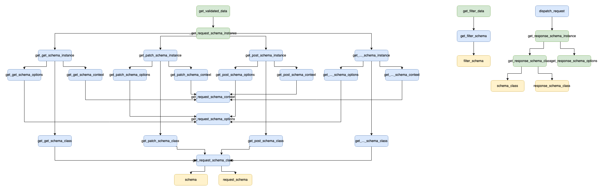

# flask-mixins
A collection of mixins to use with Flask to facilitate a cleaner architecture.

## SchemaMixin
The `SchemaMixin` is a way of abstracting some of the logic for validating and accessing the payload data and any query (filter) data, while handling the serialisation of the returned objects into json.

...

## PermissionMixin
...

## StatusCodeMixin
...

## JsonifyMixin
...

## ResourceMixin
...

## ResourcesMixin
...
