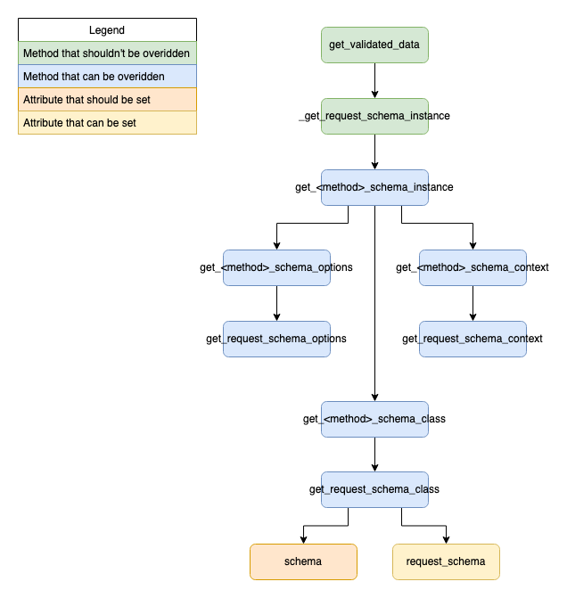

# flask-mixins
A collection of mixins to use with Flask to facilitate a cleaner architecture.

## SchemaMixin
The `SchemaMixin` is a way of abstracting some of the logic for validating and accessing the payload data and any query (filter) data, while handling the serialisation of the returned objects into json, using [Marshmallow](https://github.com/marshmallow-code/marshmallow).

The SchemaMixin isn't meant to compete with [Flask Marshmallow](https://flask-marshmallow.readthedocs.io/en/latest/) as such. It is a different approach with different priorities. The SchemaMixin is just a mixin, so it doesn't support any hyperlinking logic.

What the SchemaMixin does allow is:
1) The request schema can be defined on the MethodView, and provides a utility `self.get_validated_data()` that returns the data having been validated against the defined request schema. The request schema might vary (a POST request might require a specific schema for creating the object, while a PATCH request might require another schema). So inspired by [Django Rest Framework](https://www.django-rest-framework.org/), there are a handful of methods that can be overridden to allow the schemas to be dynamic.



2) A filter schema can be defined, that is used by the utility `self.get_filter_data()`, allowing the filter args to be validated against a dedicated marshmallow schema.


3) The `dispatch_request` is overridden so that if a non-dictionary object is returned, the object will be dumped using the provided schema, again with multiple options for overriding methods to make the schema dynamic.


### Examples
#### Example using Marshmallow and Flask-sqlalchemy
```
from flask.views import MethodView
from flask_view_mixins import SchemaMixin
from marshmallow import Schema, fields

# Your model defined somewhere
from mymodels import UserModel

class UserSchema(Schema):
  name = fields.String()
  age = fields.Int()

class UserView(SchemaMixin, MethodView):
  schema = UserSchema

  def post(self):
    user = UserModel(**self.get_validated_data())
    db.session.add(user)
    db.session.commit()
    return user, 201
```
#### Example of a filter and options override
```
from flask.views import MethodView
from flask_view_mixins import SchemaMixin

# Your model and schema defined somewhere
from mymodels import UserModel
from myschemas import UserSchema

class UserView(SchemaMixin, MethodView):
  schema = UserSchema

  def get_response_schema_options(self):
    return {"many": True}

  def get(self):
    users = UserModel.query.filter_by(**self.get_filter_data())
    return users, 200
```
#### Example with more overrides (the different schemas may perform different validation logic because in the update case, and instance already exists)
```
from flask.views import MethodView
from flask_view_mixins import SchemaMixin
from flask import request

# Your model and schema defined somewhere
from mymodels import UserModel
from myschemas import UserSchema, CreateUserSchema, UpdateUserSchema

class UserView(SchemaMixin, MethodView):
  schema = UserSchema

  def get_post_schema_class(self):
    return CreateUserSchema

  def post(self):
    user = UserModel(**self.get_validated_data())
    db.session.add(user)
    db.session.commit()
    return user, 201

  def get_patch_schema_class(self):
    return UpdateUserSchema

  def get_patch_schema_options(self):
    # Imagine that only the name can be updated
    return {"partial": True, "only": ("name",)}

  def get_patch_schema_context(self):
    # Imagine the patch schema requires the existing instance in the context
    return {"instance": UserModel.query.get(request.view_args["user_id"])}

  def patch(self, user_id: int):
    # This is a bit unsafe, but its just for demo purposes
    UserModel.query.filter(UserModel.id == user_id).update(**self.get_validated_data())
    db.session.commit()
    return None, 204

  def get_response_schema_options(self):
    return {"many": True}

  def get(self):
    users = UserModel.query.filter_by(**self.get_filter_data())
    return users, 200
```

## PermissionMixin
The `PermissionMixin` allows permission checks to be performed prior before dispatching the request. The tools for handling the permissions themselves are agnostic, but should likely rely on `request.view_args` and `g`. For the given list of the permissions, each permission will be called, and the permission should raise a `PermissionError` if it fails, and raise/return nothing if it passes.

Methods can be overridden again based to allow more dynamic permissions.


### Examples
#### Example with simple permissions
```
from flask import g


class Authenticated():
  """Permission class that assumes a middleware has attached an authenticated user"""
  @staticmethod
  def has_permission():
    if not g.user:
        raise PermissionError("Authenticated user required")


class UserView(PermissionMixin, MethodView):
  permissions = (Authenticated, )

  def post(self):
    ...

```

#### Example with overridden permissions
```
from flask import g
from mypermissions import Authenticated, IsSuperuser

class UserView(PermissionMixin, MethodView):
  permissions = (Authenticated, )

  def get_post_permissions(self):
    # Checking both is redundant, but allows for more granular error messages
    return (Authenticated, IsSuperuser)

  def post(self):
    # Only superusers can get here
    ...

  def get(self):
    # Any authenticated user can get here
    ...

```

#### Example permission implementation
The permission classes require a protocol of:
```
class Permission:
  def has_permission(self) -> None:
    # Maybe raise a PermissionError
    ...
```
So one implementation of this could be to have a base permission like:
```
class BasePermission:
  error_message = NotImplementedError

  def has_permission(self):
    if not self.check():
      raise PermissionError(self.error_message)

  def check(self) -> bool:
    raise NotImplementedError
```
That can have child permissions defined as:
```
class Authenticated(BasePermission):
  error_message = "User is not authenticated"

  def check(self) -> bool:
    return g.user is not None
```

## StatusCodeMixin
A simple mixin that allows the status code to be omitted from return value of the view, and instead has it inferred from the response content and the http method.
```
class UserView(StatusCodeMixin, MethodView):
  def get(self):
    return UserModel.query.all()  # The 200 status code is inferred
```

## JsonifyMixin
A simple mixin that converts the response object into a json response using `flask.jsonify`, it expects a dict in the response, so if used in conjunction with the SchemaMixin or the StatusCodeMixin, it would be to be the left-most parent (`UserView(JsonifyMixin, StatusCodeMixin, SchemaMixin, MethodView)`).
```
class UserView(JsonifyMixin, MethodView):
  def get(self):
    return {"name": "Tony"}, 200
```

## ResourceMixin
This is a combination of all of the above mixins, it allows fined tuned views, and assumes that the response is only returning 1 item in the GET cases, so it is best to be used when referring to a single resource, so an endpoint that has `GET/PATCH/DELETE /resource/<resource_id>`.
```
class UserView(ResourceView):
  schema = UserSchema
  permissions = (Authenticated,)

  def get(self, user_id):
    return User.query.get(user_id)  # Implicit 200

  def get_patch_schema_class(self):
    # A schema that performs a partial validation, unlike the schema used in creation
    return PatchUserSchema

  def patch(self, user_id):
    User.query.filter(User.id == user_id).update(**self.get_validated_data())
    db.session.commit()
    return None  # Implicit 204

  def get_delete_permissions(self):
    return (Authenticated, IsSuperuser)

  def delete(self, user_id):
    User.query.get(user_id).delete()
    db.session.commit()
    return None  # Implicit 204
```

## ResourcesMixin
This is a combination of all of the above mixins, it allows fined tuned views, and assumes that the response is returning multiple items in the GET cases, so it is best to be used when referring to a non-specific resource, so an endpoint that has `POST/GET /resource>`.
```
class UserView(ResourcesView):
  schema = UserSchema
  permissions = (Authenticated,)
  filter_schema = UserFilterSchema

  def get_write_permissions(self):
    return (Authenticated, IsSuperuser)

  def post(self):
    # Only superusers here
    user = User(**self.get_validated_data())
    db.session.add(user)
    db.session.commit()
    return user  # Implicit 201

  def get(self):
    # Any authenticated user here
    return User.query.filter(**self.get_filter_data())  # Implicit 200
```
If your response is paginated, its best to use the `ResourceSchema` and treat the paginated object as a single item with its own schema (that would have the nested results)
